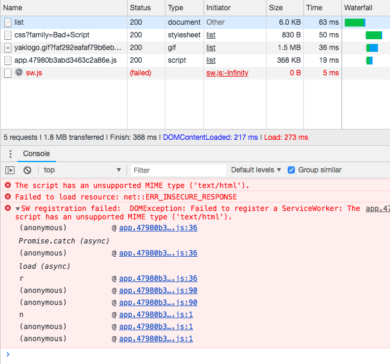

[参考](https://github.com/gzcisco720/cnode-proxy)

老师，你好，我这边新建一个文件  registerServiceWorker.js 文件

```js
# !/client/registerServiceWorker.js

export default function registerServiceWorker() {
  if ('serviceWorker' in navigator) {
    window.addEventListener('load', () => {
      navigator.serviceWorker.register('/sw.js').then((registration) => { // 注册成功
        console.log('SW registered: ', registration); // eslint-disable-line
      }).catch((registrationError) => { // 注册失败
        console.error('SW registration failed: ', registrationError); // eslint-disable-line
      })
    })
  }
}
```

然后在 app.js 中引用

```js
# !/client/app.js

...
import registerServiceWorker from './registerServiceWorker'
...
registerServiceWorker()
```

老师应该把 sw.js 新建在什么地方才可以访问到呀，还是需要怎么修改
如果是 navigator.serviceWorker.register('/sw.js') 那么网络请求的是 <http://localhost:3333/sw.js>
如果是 navigator.serviceWorker.register('/public/sw.js') 那么网络请求的是 <http://localhost:3333/public/sw.js>

还是应该修改 webpack 配置，请老师指教，困扰了很久，应该怎么才能直接访问 目录 下的 js 文件



本地开发运行 yarn dev:client 新建一个终端运行 yarn dev:server

生产版本运行 yarn build 然后运行 yarn start
