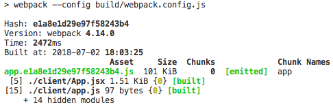
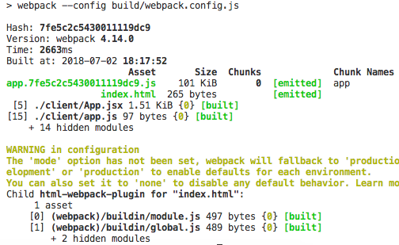

# 02. webpack loader 基础应用

我们打开 App.jsx 来书写 React 代码

```jsx
# !/client/App.jsx

import React from 'react'

export default class App extends React.Component {
  render() {
    return (
      <div>This is app</div>
    )
  }
}
```

最简单的组件就完成了，接下来书写 app.js 代码

```js
# !/client/app.js

import ReactDOM from 'react-dom'
import App from './App.jsx'

ReactDOM.render(<App />, document.body)
```

现在还没有配置省略后缀名，所以需要些 App.jsx，配置好之后就不需要写后缀名了

ReactDOM 先挂载到 document.body 后面可以挂载到 div 节点，做替换渲染

这样简单的 react app 已经完成了，接下来配置 webpack，识别 react jsx 语法

```js
# !/build/webpack.config.js

...
  module: {
    rules: [
      {
        test: /.jsx$/,
        loader: 'babel-loader'
      }
    ]
  }
...
```

rules 是一个数组配置 loader 配置 test 哪一种类型的文件我们需要去使用特定的 loader 去加载 正则表达式 以 .jsx 结尾的，我们需要安装 babel-loader,因为是开发的工具所以我们使用 `npm i babel-loader -D` babel-loader只是一个插件工具，还需要 babel-core 作为核心的代码 `npm i babel-core -D`, babel 默认编译 es6的语法，所以还需要配置编译 jsx。

在根目录下新建一个文件`.babelrc`

```json
# !/.babelrc

{
  "presets": [
    ["es2015", { "loose": true }], // es6 松散的语法配置
    "react"
  ]
}
```

presets 代表 babel 支持的语法，上面的配置也需要安装相对应的包来支持

```bash
npm i babel-preset-es2015 babel-preset-es2015-loose babel-preset-react -D
```

这样就可以支持 jsx 语法，现在先删除 dist 目录再运行 `npm run build` 看下结果

这次生成的 app.hash.js 文件有 101 KiB，文件就非常的大了



因为把 react 源码全部包含进来了

接下来希望在浏览器中打开我们的文件，首先安装 `npm i html-webpack-plugin -D`

```js
# !/build/webpack.config.js

const HTMLPlugin = require('html-webpack-plugin')

...

  plugins: [
    new HTMLPlugin()
  ]

...
```

这里只是最简单的应用，是为了生成一个 html 页面，同时在 webpack 编译的时候，把所有生成的 entry 都注入到生成的html中，而且名字和路径都是按照 output 里的配置内容拼接

现在运行 `npm run build`,运行之前 dist 目录下只有一个 app.hash.js 文件，现在运行之后



现在打开 html 发现 app.hash.js 是 404的，因为通过 webpack 启动的，只是非常简单的在这个目录下启动一个 web server, server 所有的静态文件，而没有做路径映射，所以其实是需要在 dist 目录下有个 public 目录，下面有这个 app.hash.js 文件，我们先简单的把 publicPath 设置为相对路径为空，重新编译下

打开发现 app.hash.js 已经加载进来了，但是页面没有内容，查找下错误，发现 app.js 中 App 没有使用 标签 `<App />`

然后重新编译发现 js 代码报错 jsx语法，所以需要修改 babel-loader 工具，我们需要对 js 使用 babel-loader，但是 node_modules 里不需要再编译了

```js
# !/build/webpack.config.js

...

module: {
    rules: [
      {
        test: /.jsx$/,
        loader: 'babel-loader'
      },
      {
        test: /.js$/,
        loader: 'babel-loader',
        exclude: [
          paths.appNodeModules,
        ]
      }
    ]
  },

...
```

```js
# !/build/paths.js

...
appNodeModules: resolveApp('node_modules'), // node_modules 包的路径
```

node_modules 不需要再编译

再运行 `npm run build`用浏览器打开 html 发现又报错了

> app.63ad404afbd0b20c4259.js:22 Uncaught ReferenceError: React is not defined

原因是我们在 jsx 代码中必须要 import React，因为jsx代码最终编译为`React.createElement` 函数

所以我们需要在 app.js 中增加 `import React from 'react'`,

再重新编译 `npm run build` 这样最基础的 React app 通过 webpack 就搭建完成了

[通过webpack搭建最简单的React应用](https://gitee.com/custer_git/0702-yak-python-ide/commit/fa50fcf59ba0dfb200ad20c9a8c4e56b35fa7786)