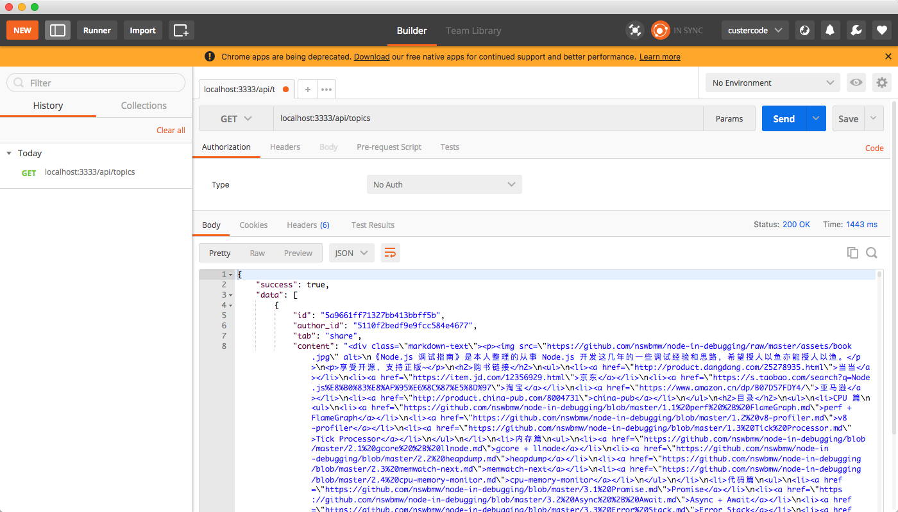

# api代理实现前后端分离

首先我们先以 [cnode api](https://cnodejs.org/api) 为示例开发,按照规范调用接口就好了

首先要安装几个工具 `npm i body-parser express-session query-string -S` body-parser 是用来转化请求 body 的，转换成 json 格式数据，以便于后期使用，express-session 是 express 插件用来存放于服务端的 session，query-string 用来把链接比如 ？= 后的url转化成 json 格式数据，可以在代码中非常方便的使用

安装完成之后来修改 server/server.js

```js
# !/server/server.js

...
const ReactSSR = require('react-dom/server')
const session = require('express-session')
...
const app = express()
app.use(bodyParser.json()) // 把app json请求格式的数据转化成 req.body 上面的数据
app.use(bodyParser.urlencoded({ extended: false })) // url 中 form data 转化成 req.body
app.use(session({ // 在服务启动阶段给 session 设值
  maxAge: 10 * 60 * 1000, // 10分钟测试用，真正上线应该存放在数据库中作为缓存或redis服务
  name: 'tid', // session 会放 cokie id 到浏览器端，给 cokie id 设置一个名字
  resave: false, // 每次请求是否重新生成 cokie id
  saveUninitialized: false,
  secret: 'react cnode api ssr mobx' // 用这个字符串加密 cokie 保证在浏览器端安全
}))

app.use(favicon(paths.faviconPath))
...
```

我们在 utils 文件夹下新建一个 handle-login.js 文件，login 这个接口要单独处理，因为要放到 session 中，不会代理到 cnode 接口，直接返回到浏览器端数据，我们需要把 login 这些数据保存到 session 中，在后期调用需要登录的接口时候，可以用到这些数据

```js
# !/server/untils/handle-login.js

const router = require('express').Router()
const axios = require('axios')

const baseUrl = 'http://cnodejs.org/api/v1'

router.post('/login', function (req, res, next) {
  axios.post(`${baseUrl}/accesstoken`, { // 发送post请求传递数据
    accesstoken: req.body.accessToken // accessToken 传给 cnode 服务，cnode提供的accesstoken T不是大写
  })
    .then(response => {
      if (response.status === 200 && response.data.success) { // 如果链接成功
        req.session.user = { // 接口返回的数据保存到 session 中
          accessToken: req.body.accessToken, // 登录的信息都保存到 req.session里
          loginName: response.data.loginname, // 下次请求就可以读取到这些信息
          id: response.data.id,
          avatarUrl: response.data.avatar_url
        }
        res.json({ // 接口争取给浏览器端发送数据
          success: true,
          data: response.data // 返回给用户
        })
      }
    })
    .catch(err => {
      if (err.response) { // 请求到cnode接口是有返回的，是业务逻辑的错误，而不是服务器直接报错
        res.json({ // 把错误信息返回给客户端
          success: false,
          data: err.response.data // 太大，嵌套层级太多，所以使用 err.response.data
        })
      } else {
        next(err) // 把错误抛给全局错误处理器去处理
      }
    })
})
module.exports = router
```

这样登录接口基本完成了，然后代理其他接口，新建一个文件 proxy.js,在这个文件中把所有发向 cnode api 的接口全部代理出去

```js
# !/server/util/proxy.js

const axios = require('axios')
const querystring = require('query-string')
const baseUrl = 'http://cnodejs.org/api/v1'

module.exports = function (req, res, next) {
  const path = req.path // 代理接口首先拿到接口地址path
  const user = req.session.user || {} // 判断用户是否登录，如果没有就是一个空对象
  const needAccessToken = req.query.needAccessToken // 判断是否需要 accessToken 放到 url 问号后面

  if (needAccessToken && !user.accessToken) { // 需要 accessToken 并且 user 里没有 accessToken
    res.status(401).send({ // 告诉客户端 401 没有登录
      success: false,
      msg: 'need login'
    })
  }

  // 通过了 if 则可以开始代理请求
  const query = Object.assign({}, req.query, {
    accesstoken: (needAccessToken && req.method === 'GET') ? user.accessToken: ''
  }) // 重新定义 query,确保在不同请求方法上有 accesstoken
  if (query.needAccessToken) delete query.needAccessToken // 删除我们自己添加的属性
  axios(`${baseUrl}${path}`, { // 请求地址是 baseUrl + path
    method: req.method, // 与客户端发送的请求方式相同
    params: query, // 请求参数
    data: querystring.stringify(Object.assign({}, req.body, { // req的body加上accessToken就算不需要加上也没有关系
      accesstoken: accesstoken: (needAccessToken && req.method === 'POST') ? user.accessToken: '' // 传给 cnode api 的都是小写没有大写
    })), // 这样请求就发送到 cnode api
    headers: { // 有的api可以接受 application/json有的不能接受
      'Content-Type': 'application/x-www-form-urlencoded' // 使用 form data 发送请求都可以接受
    }
  }).then(resp => {
    if (resp.status === 200) {
      res.send(resp.data) // 发送到客户端
    } else {
      res.status(resp.status).send(resp.data) // 原封不动的返回给客户端
    }
  }).catch(err => {
    if (err.response) {
      res.status(500).send(err.response.data)
    } else { // 设置默认错误
      res.status(500).send({
        success: false,
        msg: '未知错误'
      })
    }
  })
}
```

如何在 server.js 中使用 proxy 代理所有接口和 handle-login 处理登录接口呢？

一定要放在服务端渲染代码之前,因为服务端渲染代码所有请求来都会执行，所以先让 api 处理，如果需要 API 处理，就先处理再返回就好了

```js
# !/server/server.js

...
app.use(favicon(paths.faviconPath))

app.use('/api/user', require('./utils/handle-login.js'))
app.use('/api', require('./utils/proxy.js'))

if (!isDev) { // 不是开发环境下，才会存在 dist 目录
...
```

现在运行 `npm run dev:server` 测试接口使用 chrome 上的插件 postman



## 调试接口代理

上面完成了 cnode api 的代理，下面在实际页面发送请求的方式来测试 api 是否正常运行

目前测试的就按照三种类型，1. 无需 accessToken 2. 登录login接口 3. 需要 accessToken 的接口

在 client 目录下新建一个test 目录，新建一个文件 api-test.jsx

```js
# !/client/views/test/api-test.jsx

import React from 'react'
import axios from 'axios'

/* eslint-disable */
export default class TestApi extends React.Component {
  componentDidMount() {
    // do something here
  }

  getTopics() {
    // getTopics 用 axios 发送请求
    axios.get('/api/topics')
      .then(resp => {
        console.log(resp)
      }).catch(err => {
        console.log(err)
      })
  }

  login() {
    // login
    axios.post('/api/user/login', {
      accessToken: 'c2fa7ccf-4650-4ad0-92b6-e02332980ba8'
    }).then(resp => {
      console.log(resp)
    }).catch(err => {
      console.log(err)
    })
  }

  markAll() {
    // markAll
    axios.post('/api/message/mark_all?needAccessToken=true')
      .then(resp => {
        console.log(resp)
      }).catch(err => {
        console.log(err)
      })
  }

  render() {
    return (
      <div>
        <button onClick={this.getTopics}>topics</button>
        <button onClick={this.login}>login</button>
        <button onClick={this.markAll}>markAll</button>
      </div>
    )
  }
}
/* eslint-enable */ // 测试使用不需要 eslint 检测
```

然后加到 router.jsx 才可以在应用里访问到

```jsx
# !/client/config/router.jsx

...
import TestApi from '../views/test/api-test'
...
<Route path="/test" component={TestApi} key="test" />,
...
```

然后启动服务测试，server 和 client 都需要启动,还需要在 webpack.config.client.js 增加配置，因为 加了 router 在服务端渲染还没有配置，不可以使用，现在只能使用 client 页面访问来测试接口

```js
# !/build/webpack.config.client.js

...
    proxy: {
      '/api': 'http://localhost:3333'
    }
...
```

代理到服务端地址，这样通过客户端访问的 dev server 请求到 服务端 api

启动 `npm run dev:client` 新开命令行窗口 启动 `npm run dev:server`

访问页面 localhost:8888/test,我们看下这几个接口访问情况，打开network 点击 topic 按钮查看

[api代理实现前后端分离和调试接口代理login链接不上](https://gitee.com/custer_git/0702-yak-python-ide/commit/bc02907cadfd3909f7587062b02dec3b579ce070)
