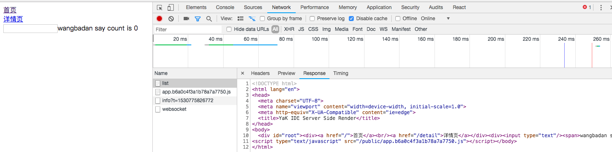
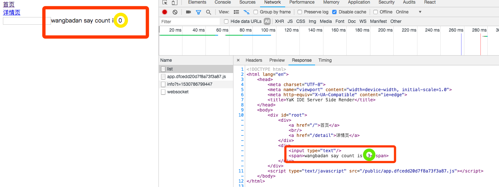

# 服务端渲染优化

在前面的项目架构中，给前端代码加入了 router store 对于服务端渲染也有一定的影响，服务端渲染内容根据不同的router 路径映射，来返回不同的 html 内容

## 路由跳转

使用者可能从任意路由进入我们的网站，所以在服务端中也必须处理路由跳转，再返回给客户端的时候就是指定页面

## store 数据同步

每个页面会有对应的数据，在服务端渲染时已经请求过对应数据，所以要让客户端知道这些数据，在客户端渲染的时候直接使用，而不是通过 API 再次请求，造成浪费

先打开项目 server-entry.js,目前值返回了 `<App/>`,和我们客户端代码已经差别很大了

```js
# !/client/app.js

...
    <AppContainer>
      <Provider appState={appState}>
        <BrowserRouter>
          <Component />
        </BrowserRouter>
      </Provider>
    </AppContainer>,
    root,
...
```

也需要把客户端这些放到服务端渲染中，首先需要使用 react-router `import { StaticRouter } from 'react-router-dom'` StaticRouter 是 react-router 专门做服务端渲染的,接受 context 是做服务端渲染的时候传递的对象，做静态渲染的时候会对这个对象进行操作，然后返回一些信息让我们做对应的操作，比如redirect 到一个地方,第二个参数是 location，现在请求的 url

`import { Provider, useStaticRendering } from 'mobx-react'` 是 mobx 专门做服务端渲染的 `useStaticRendering(true)` 需要先声明做静态渲染

服务端渲染的时候需要生成不同的 store 传递给 Provider

```js
# !/client/server-entry.js

import React from 'react'
import { StaticRouter } from 'react-router-dom'
import { Provider, useStaticRendering } from 'mobx-react'
import App from './views/App'

// 让 mobx 在服务端渲染的时候不会重复的数据变换
useStaticRendering(true)

// {appStore: xxx} 使用 ... 解构的方式
export default (stores, routerContext, url) => {
  return (
    <Provider {...stores}>
      <StaticRouter context={routerContext} location={url}>
        <App />
      </StaticRouter>
    </Provider>
  )
}
```

然后修改下 app-state.js 删除`const appState = new AppState() export default appState` 不需要创建一个实例，所以在 app.js 中就可以 `<Provider appState={new AppState()}>`

```js
# !/client/app.js

import AppState from './store/app-state'
...
const root = document.getElementById('root')
const render = (Component) => { // 使用appState={new AppState()}新建一个实例
  const renderMethod = module.hot ? ReactDOM.render : ReactDOM.hydrate
  renderMethod(
    <AppContainer>
      <Provider appState={new AppState()}>
        <BrowserRouter>
          <Component />
        </BrowserRouter>
      </Provider>
    </AppContainer>,
    root,
  )
}
```

这样做的好处是在服务端渲染的时候每次都要生成新的实例传递给服务端，这样就可以用 class 来生成

```js
# !/client/store/app-state.js

import {
  observable,
  computed,
  // autorun,
  action,
} from 'mobx'

export default class AppState {
  @observable count = 0

  @observable name = 'wangbadan'

  @computed get msg() {
    return `${this.name} say count is  ${this.count}`
  }

  @action add() {
    this.count += 1
  }

  @action changeName(name) {
    this.name = name
  }
}
```

然后来写 store.js 代码

```js
# !/client/store/store.js

import AppStateClass from './app-state'

export const AppState = AppStateClass

export default {
  AppState,
}

export const createStoreMap = () => {
  return {
    appState: new AppState(),
  }
}
```

这个函数 createStoreMap 是专门给服务端渲染做的

然后回到 server-entry.js 首先修改一个地方，因为只return内容没有做逻辑判断,所以把大括号和return去掉，精简代码

```js
# !/client/server-entry.js

import React from 'react'
import { StaticRouter } from 'react-router-dom'
import { Provider, useStaticRendering } from 'mobx-react'
import App from './views/App'
import { createStoreMap } from './store/store'

// 让 mobx 在服务端渲染的时候不会重复的数据变换
useStaticRendering(true)

// {appStore: xxx} 使用 ... 解构的方式
export default (stores, routerContext, url) => (
  <Provider {...stores}>
    <StaticRouter context={routerContext} location={url}>
      <App />
    </StaticRouter>
  </Provider>
)

export { createStoreMap }
```

export createStoreMap 这样在服务端渲染就非常有用了

现在切换到 dev-static.js, 首先把 createStoreMap 这个方法拿进来

```js
# !/server/utils/dev-static.js

...
let serverBundle, createStoreMap
...
  serverBundle = m.exports.default // 通过exports挂载从模块导出来获取 server bundle
  createStoreMap = m.exports.createStoreMap
...
    getTemplate().then(template => {

      const routerContext = {}
      const app = serverBundle(createStoreMap(), routerContext, req.url)

      const content = ReactDomServer.renderToString(app)
      res.send(template.replace('<!-- app -->', content))
    })
...
```

因为我们 server bundle 不是能够直接渲染的内容了，而是一个方法，根据方法来创建渲染内容

这样整个流程大致走通，我们运行 `npm run dev:client` 再新建一个命令行窗口 `npm run dev:server` 访问 localhost:3333 查看 network response



这是最基本的服务端渲染的内容，然后要考虑路由的 redirect ，打开我们的 router.jsx

我们显示网页源代码 访问 localhost:3333

```html
<!DOCTYPE html>
<html lang="en">
<head>
  <meta charset="UTF-8">
  <meta name="viewport" content="width=device-width, initial-scale=1.0">
  <meta http-equiv="X-UA-Compatible" content="ie=edge">
  <title>YaK IDE Server Side Render</title>
</head>
<body>
  <div id="root"><div><a href="/">首页</a><br/><a href="/detail">详情页</a></div></div>
<script type="text/javascript" src="/public/app.b6a0c4f3a1b78a7a7750.js"></script></body>
</html>
```

是没有 redirect 到 list 路由下的内容，所以我们修改 dev-static.js 代码,有 redirect 情况下 react-router 是会给 routerContext 增加一个属性叫 url ，如果有这个属性，直接在服务端给 redirect 掉

```js
# !/server/utils/dev-static.js

...
  app.get('*', function (req, res) {
    // 服务端渲染完成的结果返回给浏览器端
    getTemplate().then(template => {
      const routerContext = {}
      const app = serverBundle(createStoreMap(), routerContext, req.url)

      const content = ReactDomServer.renderToString(app)
      // 在renderToString之后拿到 routerContext
      if (routerContext.url) { // 判断routerContext有redirect情况下会增加URL属性
        res.status(302).setHeader('Location', routerContext.url) // 重定向302头
        res.end() // 结束请求 setHeader上增加属性，让浏览器自动跳转到routerContext.url
        return // 不然会继续执行下面的代码
      }

      res.send(template.replace('<!-- app -->', content))
    })
  })
...
```

这样就可以在服务端渲染的时候做好路由跳转[路由跳转的服务端渲染](https://gitee.com/custer_git/0702-yak-python-ide/commit/16b2aa1d13e946a0ab17656209e85429d0a5ed35)

接下来希望服务端渲染的时候需要用到一些异步的数据，需要拿到这些数据去渲染内容

比如说在 topic-list index.jsx里面,需要使用 msg 内容，希望去改变它，这个改变的过程又是异步的

这个异步的过程，react 本身没有提供这样的能力，在组件里写一个方法，在服务端渲染去异步调用

可以借助第三方库 `npm i react-async-bootstrapper -S` [react-async-bootstrapper](https://www.npmjs.com/package/react-async-bootstrapper)

安装完成之后打开 dev-static.js,引入新装的包 `const bootstrapper = require('react-async-bootstrapper')`

```js
# !/server/utils/dev-static.js

...
const bootstrapper = require('react-async-bootstrapper')
...
  app.get('*', function (req, res) {
    // 服务端渲染完成的结果返回给浏览器端
    getTemplate().then(template => {
      const routerContext = {}
      const app = serverBundle(createStoreMap(), routerContext, req.url)

      bootstrapper(app).then(() => { // 异步操作，可以获取到 routerContext
        if (routerContext.url) { // 判断routerContext有redirect情况下会增加URL属性
          res.status(302).setHeader('Location', routerContext.url) // 重定向302头
          res.end() // 结束请求 setHeader上增加属性，让浏览器自动跳转到routerContext.url
          return // 不然会继续执行下面的代码
        }
        const content = ReactDomServer.renderToString(app)
        // 在renderToString之后拿到 routerContext

        res.send(template.replace('<!-- app -->', content))
      })
    })
  })
...
```

这样就可以在 topic-list index.jsx中创建异步方法 `bootstrap(){}` 在这个方法里面就可以去异步的操作数据，我们想要的内容，然后在 dev-static.js 去调用 `bootstrapper(app)`方法的时候会调用组件里面的 `bootstrap(){}` 这个方法，执行完成之后才会继续去渲染

所以 `bootstrap(){}`这个方法可以很好的去执行一些数据的初始化，先做一个测试的代码

```js
# !/client/views/topic-list/index.jsx

...
  bootstrap() {
    return new Promise((resolve) => { // 只需要 resolve 就可以，因为不会出现错误的内容
      setTimeout(() => {
        this.props.appState.count = 3
        resolve(true) // 根据 true 来判断这个方法是否执行成功
      })
    })
  }
...
```

这个方法写好之后可以在 dev-static.js 中可以看下 stores 结果

```js
# !/server/utils/dev-static.js

      const routerContext = {}
      const stores = createStoreMap()
      const app = serverBundle(stores, routerContext, req.url)

      ...
      console.log(stores.appState.count)
```

bootstrapper 执行得到的结果其实是 3 ，但是网页渲染的是 1



这样就是服务端渲染的数据和客户端渲染的数据不同步，解决这个问题，在 app-state.js 中增加一个方法

这个方法是用在服务端渲染的时候将 AppState 这个实例，在服务端渲染完成之后得到的数据，然后我们去把它以json的格式拿到，之后我们用这部分数据去把它放到客户端代码能拿到的地方，让他在 init 初始化的时候就拿到这部分内容

```js
# !/client/store/app-state.js

...
  toJson() {
    return {
      count: this.count,
      name: this.name,
    }
  }
...
```

打开 dev-state.js 新建一个方法

```js
# !/server/utils/dev-state.js

...
const getStoreState = (stores) => {
  return Object.keys(stores).reduce((result, storeName) => {
    result[storeName] = stores[storeName].toJson()
    return result
  }, {})
} // 在服务端渲染结束之后数据默认值的传递，在下面拿到想要的值

module.exports = function (app) {
...

        const state = getStoreState(stores) // 这个怎么让客户端代码拿到，可以把数据插入到html
        const content = ReactDomServer.renderToString(app)
        // 在renderToString之后拿到 routerContext

        res.send(template.replace('<!-- app -->', content))
...
```

这个怎么让客户端代码拿到，可以把数据插入到html，所以这个简单的html就不能解决问题了

我们在 client 目录下新建一个 html 首先在 webpack.config.client.js

```js
# !/build/paths.js
  serverTemplateEjs: resolveApp('client/server.template.ejs') // 服务端渲染插入动态数据的html
```

新增一个模版配置，还要新增一个 loader,同时还要给它 filename 指定，以便方便的去获取

```js
# !/build/webpack.config.client.js

...
  plugins: [
    new HTMLPlugin({
      template: paths.appTemplateHtml
    }),
    new HTMLPlugin({
      template: '!!ejs-compiled-loader!' + paths.serverTemplateEjs,
      filename: 'server.ejs'
    })
  ]
...
```

最终拿到一个可以用模版引擎渲染的html，这样可以方便的把数据插到我们想要的地方

我们在 client 下新建一个文件 server.template.ejs

```ejs
# !/client/server.template.ejs

<!DOCTYPE html>
<html lang="en">
<head>
  <meta charset="UTF-8">
  <meta name="viewport" content="width=device-width, initial-scale=1.0">
  <meta http-equiv="X-UA-Compatible" content="ie=edge">
  <title>Document</title>
</head>
<body>
  <div id="root"><%%- appString %></div>
  <script>
    window.__INITIAL__STATE__ = <%%- initialState %>
  </script>
</body>
</html>
```

<%%- appString %> 这样写法可以让 ejs loader 去编译，变异之后还是 ejs 模版可以使用

然后还要安装工具 `npm i ejs-compiled-loader ejs -S`

因为修改了 webpack 配置，所以我们重新启动下 client 服务 `npm run dev:client`客户端启动成功之后，继续修改 dev-static.js

首先 `const getTemplate = () => {` 请求的就不是index.html 而是我们的 server.ejs

```js
# !/server/utils/dev-static.js

...
const serialize = require('serialize-javascript')
const ejs = require('ejs')
...
const getTemplate = () => { // 获取template
  return new Promise((resolve, reject) => {
    axios.get('http://localhost:8888/public/server.ejs')
    ...
...
        const html = ejs.render(template, { // 传入内容
          appString: content,
          initialState: serialize(state) // 把 Object 转化成对象
        })
        res.send(html)
...
```

`npm i serialize-javascript -S` 序列化 javascript 对象

这样我们客户端虽然拿到了结果，但是没有当道 store 中去，所以网页还是显示原来的内容

把初始化的数据设置到 store 中，在 app-state.js

```js
# !/client/store/app-state.js

  constructor({ count, name } = { count: 0, name: 'wangbadan' }) {
    this.count = count // 构造方法给默认值
    this.name = name
  }

  @observable count

  @observable name

```

在 app.js 中首先要读取 initialState

```js
# !/client/app.js

...
// 读取 initialState 没有就空对象
const initialState = window.__INITIAL__STATE__ || {}  // eslint-disable-line

const root = document.getElementById('root')
const render = (Component) => { // 使用appState={new AppState()}新建一个实例
  const renderMethod = module.hot ? ReactDOM.render : ReactDOM.hydrate
  renderMethod(
    <AppContainer>
      <Provider appState={new AppState(initialState.appState)}>
      ...
...
```

[服务端渲染集成mobx store](https://gitee.com/custer_git/0702-yak-python-ide/commit/324c566d769ca9c7472e2fcd5d78e1ad27c9d9ab)

还是不完整的，服务端渲染很多情况下是为了做 SEO，SEO 看重我们的 title description这些内容我们希望通过我们前后端通用的一种方式去实现
