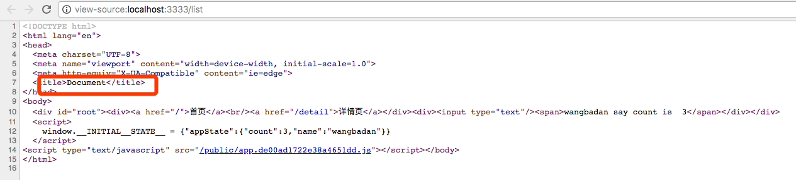

# 服务端问题解决mobx的warning以及增加title等SEO友好标签

> [mobx] Warning: there are multiple mobx instances active. This might lead to unexpected results. See <https://github.com/mobxjs/mobx/issues/1082> for details.
> 在我们服务端渲染的时候，有有多个 mobx 实例被启动了，可能会造成一些不必要的错误。
原因是对于 server-entry.js 是使用 webpack 进行打包的，而我们webpack.config.server.js 中并没有把在 node_modules 里安装的包区分出来，所以每一次打包完成的内容都可以看到完整的包含react mobx等这些类库的一整个 js，所以所有内容都包含在一个 js 里。每一次有代码更新的时候，会重新去编译出这整个文件之后，那么前一份 bundle 和后一份bundle 他们里都包含一份 mobx 实例，这就导致了每一次有代码更新的时候，重新去打包，每一份新的代码都会有单独的一份 mobx 实例。这就是这个 Warning 的原因

我们可以运行一些 npm run build:server 我们可以看下这个 server bundle 文件打包到硬盘上，看下实际输出的内容

打包完成了在 dist 目录下自动生成了一个文件 server-entry.js，这个文件会非常的大，总共 3 万多行代码，实际业务代码就 100 行不到，包含的都是 类库 代码

如何解决这个问题，我们修改 webpack.config.server.js 代码,增加一个配置项 `externals:` 指定的一些包不把它打包到输出的 js 里面

```js
# !/build/webpack.config.server.js

externals: Object.keys(require('../package.json').dependencies), // 指定的一些包不把它打包到输出的 js 里面
```

package.json 的 dependencies 下面是包含我们已经安装到 node_modules下面所有模块，这些在 node_modules 里已经有了，而这个编译完成的代码是运行在 node 环境的，所以这些类库其实都是可以 require 的方式在 js 中调用。

只是需要这样写就可以把 server-entry.js 在打包的过程中引入到 node_modules 下所有的包都不用打包到 js 里面。增加了这一行代码我们看下输出的效果，重新运行下 `npm run build:server` 看到生成的 server-entry.js 就只有 几百行，少了很多，这样就不包含任何引用类库的代码

所以在 服务端渲染的时候只需要以这种方式打包就可以了

这样配置好了 webpack.config.server.js 之后可以查看到之前运行的 `npm run dev:server` 报了一个错误 "Error: Cannot find module 'react'" 因为我们在 dev-static.js 中是使用

```js
# !/server/utils/dev-static.js

...
  const bundle = mfs.readFileSync(bundlePath, 'utf-8') // 通过bundle路径读取内容
  const m = new Module() // 编译的内容是字符串，怎么改变为模块，内容和指定文件名
  m._compile(bundle, 'server-entry.js') // 用module解析string内容，生成一个新的模块,需要动态编译要指定文件名
  serverBundle = m.exports.default // 通过exports挂载从模块导出来获取 server bundle
  createStoreMap = m.exports.createStoreMap
...
```

我们可以看到我们使用的是 `m._compile(bundle, 'server-entry.js')` 这种方式将我们打包出来的 server-entry.js 字符串 compile 到一个 modules，使用这种方式它无法使用 require，无法从 node_modules 里去引用包，因为在新的这个 bundle 里面，模块并没有打包进去，是需要通过 require node_modules,解决这个问题，我们需要新建一个方法

```js
# !/server/utils/dev-static.js

...
// const Module = module.constructor // 通过构造方法创建一个新的 Module
const NativeModule = require('module') // 重新引用 Module - 原生的模块
const vm = require('vm') // vm模块在V8虚拟机上下文中提供了编译和运行代码的API。JavaScript代码可以被编译然后立即运行，或者编译，保存，并且之后运行。

/* wrap 包装成的形式 (function(exports, requires, module, __filename, __dirname){ ...bundle code }),这样包装之后就可以传入 exports,这样字符串代码才会变成上面的形式，就可以使用 require exports module 内容以模块传入
*/
const getModuleFromString = (bundle, filename) => {
  const m = { exports: {} } // 声明一个变量 m
  const wrapper = NativeModule.wrap(bundle) // wrap 可执行的 JavaScript 代码包装
  const script = new vm.Script(wrapper, { // vm.Script类的实例包含的预编译脚本可以在沙箱中被执行（或者上下文环境中）。
    filename: filename,
    displayErrors: true
  })
  const result = script.runInThisContext() // 运行被vm.Script包含的含有当前全局对象上下文的编译好的代码。运行的代码不能访问本地变量，但是可以访问当前的全局对象。 - 指定执行环境
  result.call(m.exports, m.exports, require, m) // m.exports作为调用者调用 result 代码，这个 require 是传入的当前环境的 require，这样就解决了之前的问题
  return m
} // 常规的拿到 string 代码以 module 方式调用，之前的方式是不推荐的
...
  const bundle = mfs.readFileSync(bundlePath, 'utf-8') // 通过bundle路径读取内容
  // const m = new Module() // 编译的内容是字符串，怎么改变为模块，内容和指定文件名
  const m = getModuleFromString(bundle, 'server-entry.js')
  // m._compile(bundle, 'server-entry.js') // 用module解析string内容，生成一个新的模块,需要动态编译要指定文件名
  serverBundle = m.exports.default // 通过exports挂载从模块导出来获取 server bundle
  createStoreMap = m.exports.createStoreMap
...
```

上面就是常规的拿到 string 代码以 module 方式调用，之前的方式是不推荐的

接下来解决另一个问题SEO标签，首先查看下网页源代码 `npm run dev:client` 新开命令行 `npm run dev:server` 访问 <http://localhost:3333> 查看网页源代码



首先我们希望每个页面的 title 都在相应页面里去定义，这个时候我们需要使用工具来帮助我们解决这个问题

`npm i react-helmet -S` 安装完成之后，打开 top-list 目录,进入 index.jsx 文件 直接在代码中使用 Helmet这个组件

```jsx
# !/client/views/topic-list/index.jsx

...
import Helmet from 'react-helmet'
...
  render() {
    return (
      <div>
        <Helmet>
          <title>This is topic-list</title>
          <meta name="description" content="This is description" />
        </Helmet>
        <input type="text" onChange={this.changeName} />
        <span>{this.props.appState.msg}</span>
      </div>
    )
  }
...
```

这些需要作为服务端渲染的时候 html 已经拥有，这样 SEO 才能真正使用到这些信息

我们来修改 dev-static.js 代码

```js
# !/server/utils/dev-static.js

...
const Helmet = require('react-helmet').default
...
      bootstrapper(app).then(() => { // 异步操作，可以获取到 routerContext
        if (routerContext.url) { // 判断routerContext有redirect情况下会增加URL属性
          res.status(302).setHeader('Location', routerContext.url) // 重定向302头
          res.end() // 结束请求 setHeader上增加属性，让浏览器自动跳转到routerContext.url
          return // 不然会继续执行下面的代码
        }

        const helmet = Helmet.rewind() // 调用这个方法 SEO title、meta、content信息
        const state = getStoreState(stores) // 这个怎么让客户端代码拿到，可以把数据插入到html
        const content = ReactDomServer.renderToString(app)
        // 在renderToString之后拿到 routerContext

        const html = ejs.render(template, { // 传入内容
          appString: content,
          initialState: serialize(state), // 把 Object 转化成对象
          meta: helmet.meta.toString(),
          title: helmet.title.toString(),
          style: helmet.style.toString(),
          link: helmet.link.toString()
        })
...
```

相应的调整 server.template.ejs

```ejs
# !/client/server.template.ejs

<!DOCTYPE html>
<html lang="en">
<head>
  <meta charset="UTF-8">
  <meta name="viewport" content="width=device-width, initial-scale=1.0">
  <meta http-equiv="X-UA-Compatible" content="ie=edge">

  <%%- meta %>

  <%%- title %>

  <%%- link %>

  <%%- style %>
</head>
<body>
  <div id="root"><%%- appString %></div>
  <script>
    window.__INITIAL__STATE__ = <%%- initialState %>
  </script>
</body>
</html>
```

重新请求页面就可以看到变动了

[开发环境下的服务端渲染配置基本形成]()
