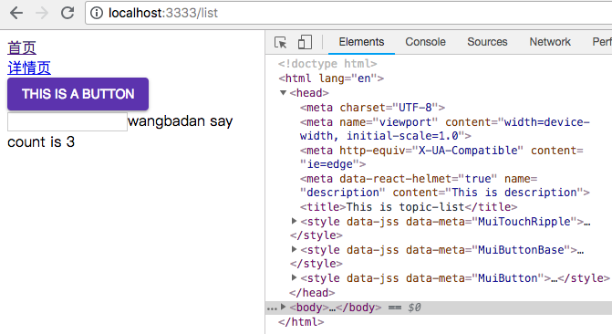
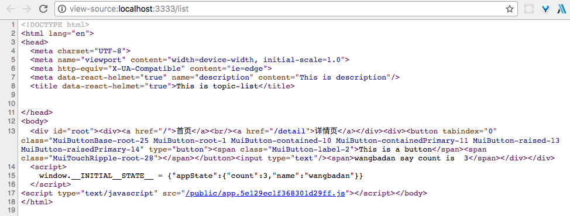

# Material-ui安装配置使用

`npm install @material-ui/core @material-ui/icons -S` 安装正式版本

安装完成之后先在客户端配置，首先打开 client/app.js 文件来[配置主题](https://material-ui.com/customization/themes/#themes)

`import { MuiThemeProvider, createMuiTheme } from '@material-ui/core/styles'` 导入主题

[颜色 color 系统](https://material-ui.com/style/color/#color)

然后 theme 主题创建完成之后把 theme 挂载到整个 App 上面

```js
# !/client/app.js

...
import { MuiThemeProvider, createMuiTheme } from '@material-ui/core/styles'
import { lightBlue, purple } from '@material-ui/core/colors'
...
const theme = createMuiTheme({ // 主题颜色
  palette: {
    primary: lightBlue, // 主色调
    accent: purple, // 次要颜色
    type: 'light',
  },
})
...
        <BrowserRouter>
          <MuiThemeProvider theme={theme}>
            <Component />
          </MuiThemeProvider>
        </BrowserRouter>
        ...
```

这样就可以在应用中使用 Material-ui 了，如何使用呢,比如我们在 topic-list 目录下打开 index.jsx 文件

`import Button from '@material-ui/core/Button'`

在使用 Material-ui 每个组件都要单独的 import,这样就可以按需加载

```js
# !/client/views/topic-list/index.jsx

...
import Button from '@material-ui/core/Button'
...
  render() {
    return (
      <div>
        <Helmet>
          <title>This is topic-list</title>
          <meta name="description" content="This is description" />
        </Helmet>
        <Button variant="contained" color="primary">This is a button</Button>
        <input type="text" onChange={this.changeName} />
        <span>{this.props.appState.msg}</span>
      </div>
    )
  }
...
```

运行 `npm run dev:client` 打开新的终端运行 `npm run dev:server`

可以查看到网页的 head 样式



但是 网页源代码 head 中没有 css 样式



所以是页面刚开始加载的时候是没有 css 样式的，等待 js 运行结束之后会插入到 head 中，才会有样式

所以需要增加一些服务端渲染的配置，让它在服务端渲染结束就有样式

首先打开 server-entry.js 安装几个包 `npm i react-jss jss jss-preset-default -S` 这样就可以[在服务端使用 Material-ui](https://material-ui.com/guides/server-rendering/)

> Create a fresh, new `sheetsRegistry` and `theme` instance on every request.
每次一个请求都要创建 `sheetsRegistry` 和 `theme`。Pull the CSS out of the sheetsRegistry. 把 css 从 `sheetsRegistry` 中拿出来 Pass the CSS along to the client. 然后把 CSS 渲染到客户端

他给的实例是使用 import 语法，服务端代码不支持 import 语法，需要使用 babel 编译，这样很浪费资源，也很可能出现错误，效率也不会非常的高，所以我们现在还是使用 nodejs 能够执行的代码来完成服务端的内容，可以参考他们的代码来实现，所以 `JssProvider` 和 `MuiThemeProvider` 都是使用在 server-entry.js 中，因为 theme 是每个请求都要重新创建的，所以 `sheetsRegistry` 和 `theme` 是放在 server-render.js 中

```js
# !/client/views/server-entry.js

...
import JssProvider from 'react-jss/lib/JssProvider'
import { MuiThemeProvider } from '@material-ui/core/styles'
...
// {appStore: xxx} 使用 ... 解构的方式
export default (stores, routerContext, sheetsRegistry, generateClassName, theme, url) => (
  <Provider {...stores}>
    <StaticRouter context={routerContext} location={url}>
      <JssProvider registry={sheetsRegistry} generateClassName={generateClassName}>
        <MuiThemeProvider theme={theme}>
          <App />
        </MuiThemeProvider>
      </JssProvider>
    </StaticRouter>
  </Provider>
)
...
```

这样 server-entry.js 功能就完成了，接下来要到 server-render.js 来创建这些传入的参数

```js
# !/server/utils/server-render.js

...

const SheetsRegistry = require('react-jss').SheetsRegistry
const createGenerateClassName = require('@material-ui/core/styles').createGenerateClassName
const createMuiTheme = require('@material-ui/core/styles').createMuiTheme
const colors = require('@material-ui/core/colors')

...
    const stores = createStoreMap()
    const sheetsRegistry = new SheetsRegistry() // 创建 Material-ui sheetsRegistry
    const generateClassName = createGenerateClassName() // 创建 Material-ui generateClassName
    const theme = createMuiTheme({ // 创建 Material-ui theme
      palette: {
        primary: colors.deepPurple,
        accent: colors.lightBlue,
        type: 'light'
      }
    }) // 需要的东西都创建完成了，传值给 app
    const app = createApp(stores, routerContext, sheetsRegistry, generateClassName, theme, req.url)
...
        link: helmet.link.toString(),
        // 需要把 Material-ui 样式放入 template 里买呢
        materialCss: sheetsRegistry.toString()
      })
...
```

再修改下 server.template.ejs 模版

```ejs
# !/client/server.template.ejs

...
  <style>
    <%%- materialCss %>
  </style>
...
```

这里还有一个小问题 在 The Client Side 需要把服务端生成的去掉，因为在 客户端渲染的时候同样会生成 css 插入到head，这样服务端和客户端的 css 就可能出现冲突

首先修改下 ejs 模版增加 style id

```ejs
# !/client/server.template.ejs

...
  <style id="jss-server-side">
    <%%- materialCss %>
  </style>
...
```

然后需要创建一个 class render 的内容就是整个 App，只不过这个 class 增加了一个 componentDidMount() 生命周期方法，在这里把这个节点给删除

```js
# !/client/app.js

...
const initialState = window.__INITIAL__STATE__ || {}  // eslint-disable-line

const createApp = (TheApp) => {
  class Main extends React.Component {
    // Remove the server-side injected CSS.
    componentDidMount() {
      const jssStyles = document.getElementById('jss-server-side');
      if (jssStyles && jssStyles.parentNode) {
        jssStyles.parentNode.removeChild(jssStyles);
      }
    }

    render() {
      return <TheApp />
    }
  }
  return Main
}
...
render(createApp(App))
...
    render(createApp(NextApp))
  })
}
```

[Material安装使用和服务端配置]()
